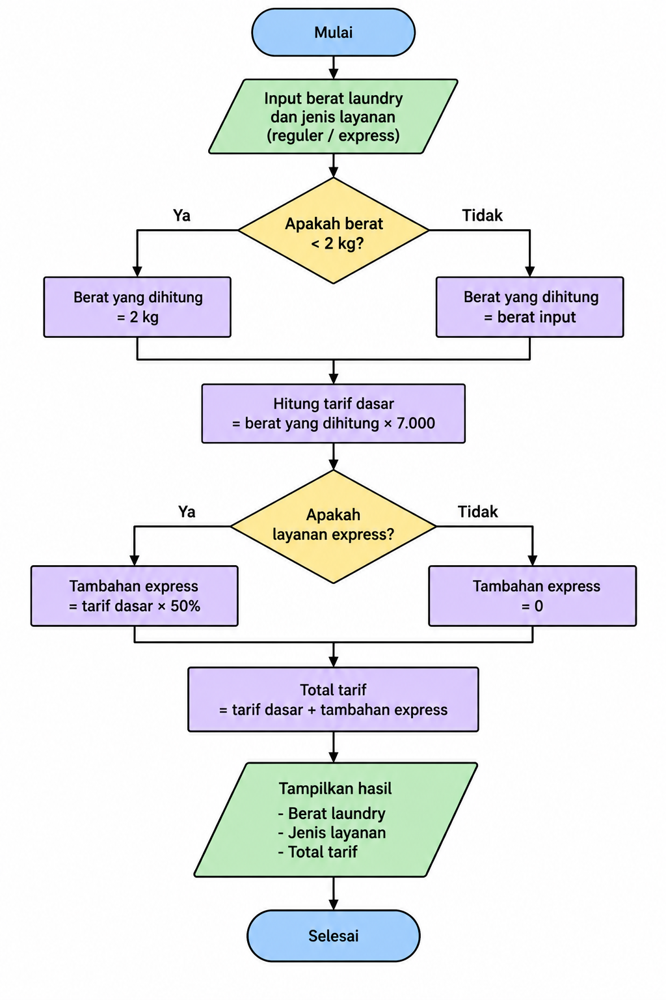

# Latihan — Tarif Laundry

## Kelompok

* **Daffa Dermawan** (1124160177)

---

# A. Dokumen Analisis

### 1. Problem Statement

Program menerima data berupa berat laundry dan jenis layanan yang digunakan. Tarif dasar laundry adalah **Rp7.000 per kilogram**.

Jika berat laundry kurang dari 2 kg, maka berat tersebut tetap dihitung sebagai **2 kg**.

Selain layanan reguler, terdapat layanan **express**. Jika pelanggan memilih layanan express, maka tarif laundry mendapatkan tambahan sebesar **50%** dari tarif dasar.

Program kemudian menghitung dan menampilkan total tarif laundry.

---

### 2. Actor

Actor yang menggunakan sistem adalah **Petugas Laundry**.

Petugas laundry memberikan atau memasukkan:

* Berat laundry.
* Jenis layanan.

Setelah data diproses, program menampilkan total tarif laundry.

---

### 3. Input & Output

#### Input

| Data          | Tipe      |            Contoh |
| ------------- | --------- | ----------------: |
| Berat laundry | `double`  |             `3.5` |
| Jenis layanan | `Layanan` | `Layanan.express` |

Berat laundry menggunakan satuan **kilogram (kg)**.

Jenis layanan menggunakan `enum`:

```dart
enum Layanan {
  reguler,
  express,
}
```

Contoh input:

```dart
double berat = 3.5;
Layanan layanan = Layanan.express;
```

#### Output

Program menampilkan:

* Berat laundry.
* Jenis layanan.
* Total tarif.

Contoh:

```text
Berat: 3.5 kg | Layanan: express | Total: Rp36750
```

---

### 4. Functional Requirement

Program memiliki beberapa fungsi utama:

1. Menerima berat laundry.
2. Menerima jenis layanan.
3. Menentukan berat minimum yang dihitung.
4. Menghitung tarif berdasarkan berat.
5. Menghitung tambahan 50% untuk layanan express.
6. Menghitung total tarif.
7. Menampilkan hasil perhitungan.

---

### 5. Business Rules

| Kode      | Business Rule                                                      |
| --------- | ------------------------------------------------------------------ |
| **BR-01** | Tarif laundry adalah Rp7.000 per kilogram.                         |
| **BR-02** | Berat laundry di bawah 2 kg tetap dihitung sebagai 2 kg.           |
| **BR-03** | Layanan express dikenakan tambahan sebesar 50% dari tarif laundry. |

---

### 6. Decomposition

Atau proses membagi masalah menjadi beberapa bagian supaya lebih mudah dikerjakan.

```text
Tarif Laundry
│
├── Menentukan berat
│   ├── Menerima berat laundry
│   └── Cek berat minimum 2 kg
│
├── Menentukan layanan
│   ├── Reguler
│   └── Express
│
├── Menghitung tarif
│   ├── Tarif dasar
│   └── Tambahan express
│
└── Menampilkan hasil
    └── Total tarif
```

Jadi di sini kami tidak langsung membuat semua kode sekaligus, melainkan membagi masalah menjadi beberapa bagian kecil.

---

### 7. Pattern Recognition

Setelah melihat aturan laundry, terdapat pola perhitungan yang sama pada setiap transaksi.

Pola dasarnya:

```text
Berat laundry
      ↓
Cek berat minimum
      ↓
Hitung tarif dasar
      ↓
Cek jenis layanan
      ↓
Jika express → tambah 50%
      ↓
Hitung total
      ↓
Tampilkan hasil
```

Rumus tarif dasar:

```text
Tarif dasar = berat yang dihitung × Rp7.000
```

Jika menggunakan express:

```text
Tambahan express = tarif dasar × 50%
```

Kemudian:

```text
Total = tarif dasar + tambahan express
```

Contohnya jika berat laundry adalah `3 kg`:

```text
Tarif dasar:

3 × Rp7.000
= Rp21.000
```

Jika menggunakan express:

```text
Tambahan:

Rp21.000 × 50%
= Rp10.500
```

Maka:

```text
Total:

Rp21.000 + Rp10.500
= Rp31.500
```

---

### 8. Abstraction

Pada latihan ini kami menggunakan `enum` untuk membatasi pilihan jenis layanan.

```dart
enum Layanan {
  reguler,
  express,
}
```

Dengan menggunakan `enum`, pilihan layanan hanya dapat berupa:

```text
Layanan.reguler
Layanan.express
```

Contoh penggunaan:

```dart
hitungLaundry(3, Layanan.express);
```

Function utama yang digunakan:

```dart
String hitungLaundry(
  double berat,
  Layanan layanan,
)
```

Function tersebut menerima:

```text
berat
layanan
```

Kemudian menghitung total tarif berdasarkan business rule yang telah ditentukan.

Penggunaan `enum` lebih jelas dibandingkan menggunakan `bool`, karena kode:

```dart
Layanan.express
```

langsung menunjukkan jenis layanan yang digunakan.

---

### 9. Flowchart

Alur utama program:



---

### 10. Pseudocode

```text
START

INPUT berat
INPUT layanan

IF berat < 2 THEN
    berat ← 2
END IF

tarifDasar ← berat × 7000

tambahanExpress ← 0

IF layanan = express THEN
    tambahanExpress ← tarifDasar × 50%
END IF

totalTarif ← tarifDasar + tambahanExpress

Tampilkan berat
Tampilkan layanan
Tampilkan totalTarif

END
```

---

# B. Implementasi Dart

```dart
void main() {
  print(hitungLaundry(1.5, Layanan.reguler));
  print(hitungLaundry(2, Layanan.reguler));
  print(hitungLaundry(3, Layanan.express));
  print(hitungLaundry(5.5, Layanan.express));
}

enum Layanan {
  reguler,
  express,
}

String hitungLaundry(
  double berat,
  Layanan layanan,
) {
  // BR-02
  // Jika berat di bawah 2 kg,
  // maka tetap dihitung sebagai 2 kg
  if (berat < 2) {
    berat = 2;
  }

  // BR-01
  // Tarif Rp7.000 per kg
  double tarifDasar = berat * 7000;

  // Nilai awal tambahan express
  double tambahanExpress = 0;

  // BR-03
  if (layanan == Layanan.express) {
    tambahanExpress = tarifDasar * 0.50;
  }

  // Total tarif
  double totalTarif = tarifDasar + tambahanExpress;

  return 'Berat: $berat kg | '
      'Layanan: ${layanan.name} | '
      'Total: Rp${totalTarif.toStringAsFixed(0)}';
}
```

---

# C. Skenario Pengujian

| Skenario |  Berat | Layanan | Perhitungan  | Expected |    Hasil |
| -------- | -----: | ------- | ------------ | -------: | -------: |
| 1        | 1.5 kg | Reguler | 2 × 7.000    | Rp14.000 | Rp14.000 |
| 2        |   2 kg | Reguler | 2 × 7.000    | Rp14.000 | Rp14.000 |
| 3        |   3 kg | Express | 21.000 + 50% | Rp31.500 | Rp31.500 |
| 4        | 5.5 kg | Express | 38.500 + 50% | Rp57.750 | Rp57.750 |

---

# D. Traceability

| Business Rule | Bagian Program                    | Skenario   |
| ------------- | --------------------------------- | ---------- |
| BR-01         | `berat * 7000`                    | 1, 2, 3, 4 |
| BR-02         | `if (berat < 2)`                  | 1          |
| BR-03         | `if (layanan == Layanan.express)` | 3, 4       |

Contoh hubungan **BR-01** dengan kode:

```dart
double tarifDasar = berat * 7000;
```

Artinya setiap kilogram laundry dikenakan tarif Rp7.000.

Contoh hubungan **BR-02** dengan kode:

```dart
if (berat < 2) {
  berat = 2;
}
```

Artinya jika berat laundry kurang dari 2 kg, sistem tetap menghitungnya sebagai 2 kg.

Contoh hubungan **BR-03** dengan kode:

```dart
if (layanan == Layanan.express) {
  tambahanExpress = tarifDasar * 0.50;
}
```

Artinya jika layanan yang dipilih adalah `express`, maka tarif dasar mendapatkan tambahan sebesar 50%.

---

# E. Contoh Trace Skenario 3

Input:

```text
Berat   = 3 kg
Layanan = Layanan.express
```

### Langkah 1 — Cek berat

```text
3 < 2
```

Hasil:

```text
FALSE
```

Berat tetap:

```text
3 kg
```

### Langkah 2 — Hitung tarif dasar

```text
3 × Rp7.000
= Rp21.000
```

### Langkah 3 — Cek layanan

Program memeriksa:

```text
Layanan.express == Layanan.express
```

Hasil:

```text
TRUE
```

Maka mendapatkan tambahan 50%.

```text
Rp21.000 × 50%
= Rp10.500
```

### Langkah 4 — Hitung total

```text
Rp21.000 + Rp10.500
= Rp31.500
```

Hasil akhir:

```text
Berat: 3.0 kg | Layanan: express | Total: Rp31500
```
